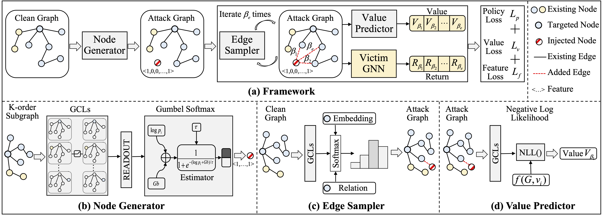

# Source Code for AAAI'23 paper: Let Graph be the Go Board: Gradient-free Node Injection Attack for Graph Neural Networks via Reinforcement Learning



## Instruction 

Hi all, this is the official repository for AAAI 2023 paper: **Let Graph be the Go Board: Gradient-free Node Injection Attack for Graph Neural Networks via Reinforcement Learning**. Our paper can be found at [[arXiv link]](https://arxiv.org/abs/2211.10782). We sincerely apprecaite your interests in our projects!

To reproduce our experiments on Cora, Citeseer, Pubmed, Am. Photo, Am. Comp., Wiki. CS., please simple run the following code 

```
python actor_critic --dataset ${dataset}
```

The default setting for this script is single target injection attack, where, to attack one target node, only one node, one edge and zero feature distribution shift are allowed. 

However you can easily extend our attack scheme into any budget combination, by specifying **--node_budget**, **--edge_budget**, and **--feature_budget**.

To change the architecture of the victim model, please specify **--victim_model** with **gcn**, **sgc**, **gat**, **appnp**. 

To reproduce our experiments on OGB-Prod. and Reddit, please first download the pre-processed dataset from the official repo of G-NIA from this [link](https://github.com/TaoShuchang/G-NIA), and restructure the working directory as the following:

```
G2A2C
|   README.md
|   actor_critic.py
|   attack_utils.py
|   model.py
|
|----datasets
|    |   files downloaded from G_NIA
|       

```

## Dependencies
The main libraries we utilize are:

- torch===1.11.0
- dgl==0.9.0
- pyro-ppl==1.8.1

## Cite
If you find this repository useful in your research, please cite our paper:

```bibtex
@inproceedings{ju2022let,
  title={Let Graph be the Go Board: Gradient-free Node Injection Attack for Graph Neural Networks via Reinforcement Learning},
  author={Ju, Mingxuan and Fan, Yujie and Zhang, Chuxu and Ye, Yanfang},
  booktitle={Thirty-Seventh AAAI Conference on Artificial Intelligence},
  year={2023}
}
```

## Credit
Some dataloading scripts come from the official repository of G-NIA [link](https://github.com/TaoShuchang/G-NIA). 

## Contact
Mingxuan Ju (mju2@nd.edu)